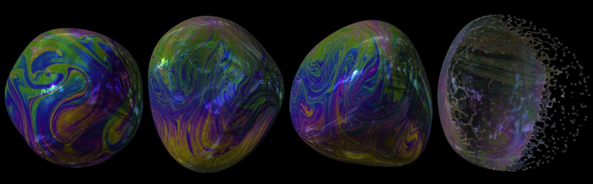

# MELP: A Moving Eulerian-Lagrangian Particle Method for Thin Film and Foam Simulation

[Yitong Deng](https://yitongdeng.github.io/), [Mengdi Wang](https://wang-mengdi.github.io/), Xiangxin Kong, [Shiying Xiong](https://shiyingxiong.github.io/), Zangyueyang Xian, [Bo Zhu](https://faculty.cc.gatech.edu/~bozhu/)

This repo stores the source code of our SIGGRAPH 2022 paper **MELP: A Moving Eulerian-Lagrangian Particle Method for Thin Film and Foam Simulation**.

<figure>
  
</figure>
 

## Abstract

We present the Moving Eulerian-Lagrangian Particles (MELP), a novel mesh-free method for simulating incompressible fluid on thin films and foams. Employing a bi-layer particle structure, MELP jointly simulates detailed, vigorous flow and large surface deformation at high stability and efficiency. In addition, we design multi-MELP: a mechanism that facilitates the physically-based interaction between multiple MELP systems, to simulate bubble clusters and foams with non-manifold topological evolution. We showcase the efficacy of our method with a broad range of challenging thin film phenomena, including the Rayleigh-Taylor instability across double-bubbles, foam fragmentation with rim surface tension, recovery of the Plateau borders, Newton black films, as well as cyclones on bubble clusters.

## Usage

1. Install the newest version of [`xmake`](https://xmake.io/#/) build tool.
2. Build the project (you may be prompted to install a few packages):

        $ cd melp-thin-film
        $ xmake -v melp
3. Run the single bubble example code

        $ xmake r melp -driver 1 -test 1 -o output
4. Visualize the output data in `./output` folder via [`ParaView`](https://www.paraview.org/)

You can use the color mapping encoded in `thinfilm_colormap.xml`for `ParaView`.

